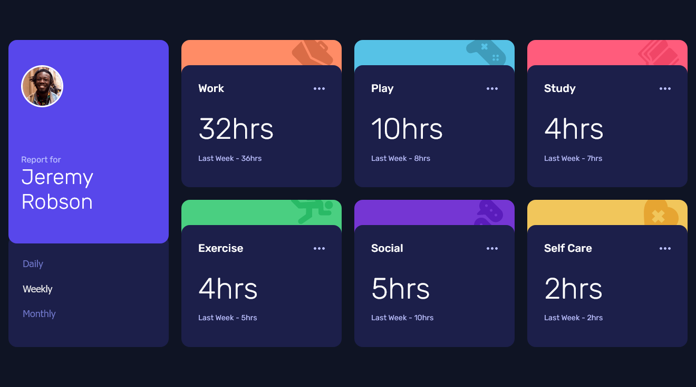
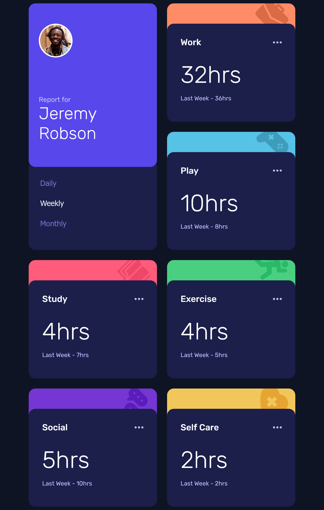
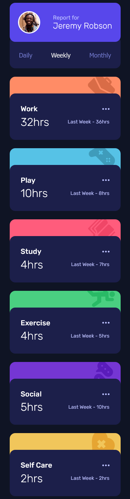

<!-- markdownlint-disable MD033 -->
<h1 align="center">Frontend Mentor - Time Tracking Dashboard</h1>

This is a solution to Frontend Mentor's <a href="https://www.frontendmentor.io/challenges/time-tracking-dashboard-UIQ7167Jw"> Time Tracking Dashboard challenge.</a>

<h3 align="center">Languages</h3>

  <a href="#">English</a> • <a href="./lang/README.pt-br.md">Português</a>

<!-- markdownlint-enable MD033 -->

## Table of contents

- [Overview](#overview)
  - [The challenge](#the-challenge)
  - [Screenshots](#screenshots)
  - [Links](#links)
- [My process](#my-process)
  - [Built with](#built-with)
  - [What I learned](#what-i-learned)
  - [Useful resources](#useful-resources)
- [Author](#author)

## Overview

### The challenge

Users should be able to:

- View the optimal layout for the site depending on their device's screen size
- See hover states for all interactive elements on the page
- Switch between viewing Daily, Weekly, and Monthly stats

### Screenshots

| Desktop View (1280px) | Tablet View (768px) | Mobile View (375px)|
|-------|-------|-------|
||||

### Links

- Live Site URL: [Cloudfare Pages](https://fm--time-tracking-dashboard.pages.dev)

## My process

### Built with

- Semantic HTML5 markup
- CSS Custom Properties
- CSS Grid
- Flexbox
- React
- Sass

### What I learned

Since this was my first solo project with React – after the projects of video classes – I've learned plenty of things about it! I specially tried to apply a file structure to keep things very organized, which was a novel to me as well.

There isn't a great challenge on using React here, but that was the intention, since if I got something too hard I wouldn't be able to focus on solidifying the basics. But I added some challenges, like dinamically generating the card components, which the most challenge was creating its different background colors dinamically.

### Useful resources

I based the files structure from [This tutorial video](https://www.youtube.com/watch?v=3HNyXCPDQ7Q), which shows a great way of organizing everything, in my opinion.

## Author

- [My Website](https://amodeusr.pages.dev)
- Github - [@AmodeusR](https://github.com/amodeusr)
- Linkedin - [@AmodeusR](https://www.linkedin.com/in/AmodeusR)
- Frontend Mentor - [@AmodeusR](https://www.frontendmentor.io/profile/AmodeusR)
