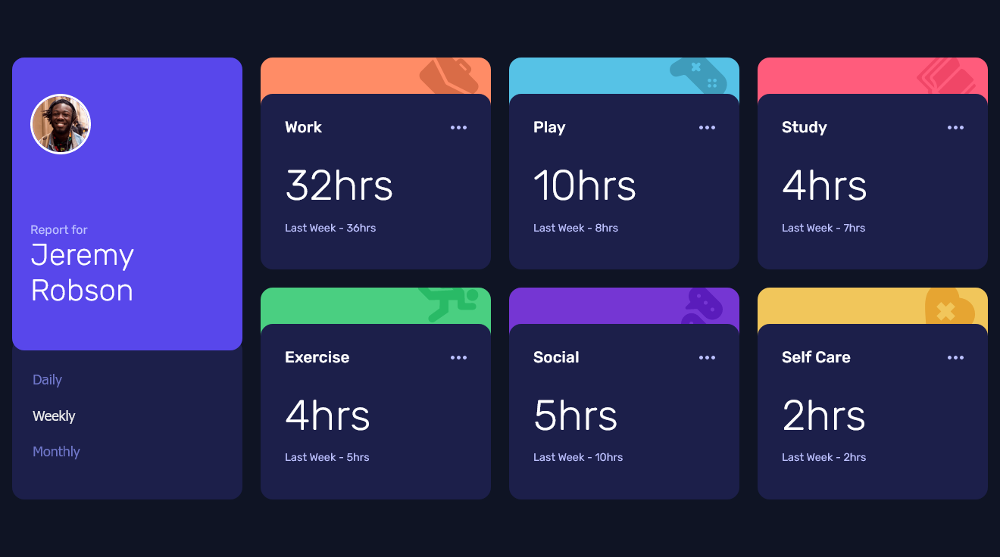
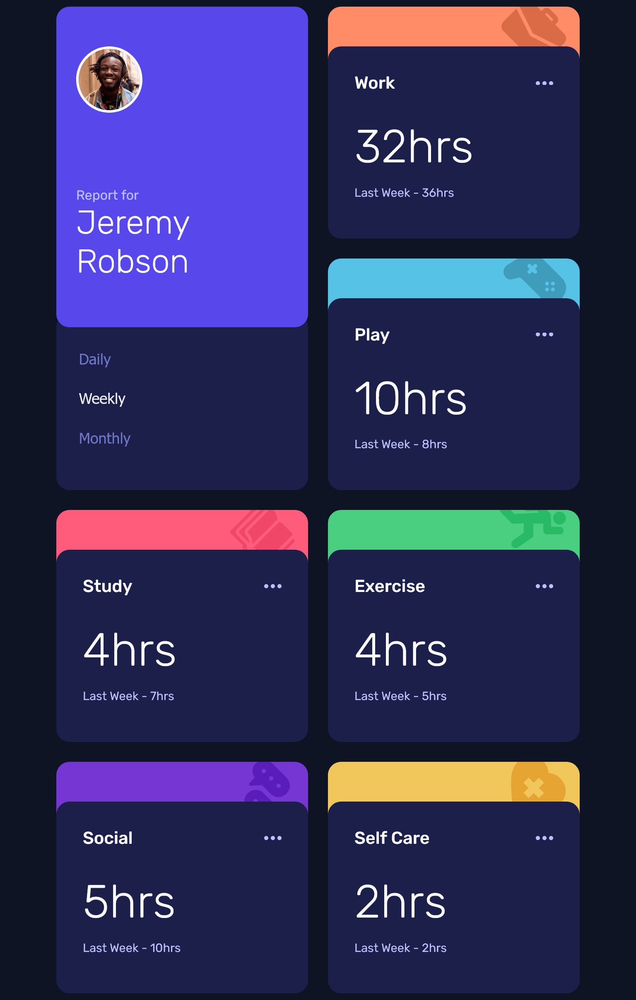
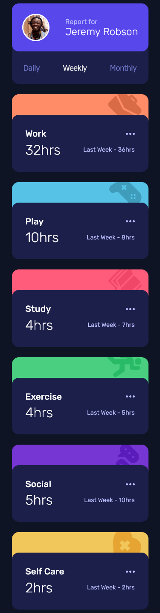

<!-- markdownlint-disable MD033 -->
<h1 align="center">Frontend Mentor - Time Tracking Dashboard</h1>

Esta é uma resolução ao desafio <a href="https://www.frontendmentor.io/challenges/time-tracking-dashboard-UIQ7167Jw">Time Tracking Dashboard</a> por Frontend Mentor.

<h3 align="center">Idiomas</h3>

  <a href="../README.md">English</a> • <a href="#">Português</a>

<!-- markdownlint-enable MD033 -->

## Índice

- [Visão Geral](#visão-geral)
  - [O desafio](#o-desafio)
  - [Capturas de tela](#capturas-de-tela)
  - [Links](#links)
- [Meu processo](#meu-processo)
  - [Desenvolvido com...](#desenvolvido-com)
  - [O que aprendi](#o-que-aprendi)
  - [Recursos úteis](#recursos-úteis)
- [Autor](#autor)

## Visão geral

### O desafio

Usuários devem ser capazes de:

- Exibir o layout ideal para o usuário dependendo do tamanho da tela do seu dispositivo
- Exibir hover states para todos os elementos interativos da página
- Mudar entre os status Diários, Semanais e Mensais

### Capturas de tela

| Tela Desktop (1280px) | Tela Tablet (768px) | Tela Celular (375px) |
|-------|-------|-------|
||||

### Links

- URL para o Site: [Cloudfare Pages](https://fm--time-tracking-dashboard.pages.dev)

## Meu processo

### Desenvolvido com...

- Marcação semântica HTML
- Propriedades personalizadas CSS
- CSS Grid
- Flexbox
- React
- Sass

### O que aprendi

Considerando que este foi meu primeito projet solo com React – à parte dos exercícios e desafios de vídeo-aulas de React – Eu aprendi muito! Eu especialmente busquei aplicar uma estrutura de arquivos para manter tudo muito organizado, o que foi algo novo para mim também.

Não há um grande desafio em usar o React com este projeto, mas esta era a intenção, já que se eu pegasse algo muito difícil, eu não seria capaz de focar em solidificar o básico. Mas eu adicionei alguns desafios, como gerar os componentes card dinamicamente, o qual o mais desafiador foi criar seus diferentes planos de fundo dinamicamente.

### Recursos úteis

Eu baseei a estrutura de arquivos [nesta vídeo-aula](https://www.youtube.com/watch?v=3HNyXCPDQ7Q), a qual mostra uma ótima forma de organizar tudo, na minha opinião.

## Autor

- [Meu site](https://amodeusr.pages.dev)
- Github - [@AmodeusR](https://github.com/amodeusr)
- Linkedin - [@AmodeusR](https://www.linkedin.com/in/AmodeusR)
- Frontend Mentor - [@AmodeusR](https://www.frontendmentor.io/profile/AmodeusR)
